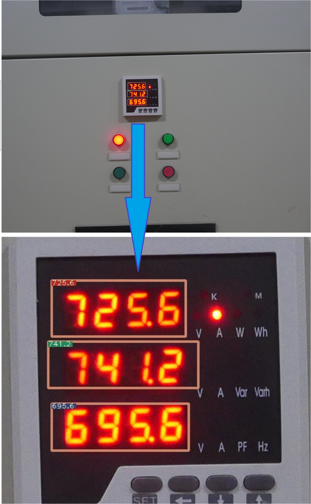
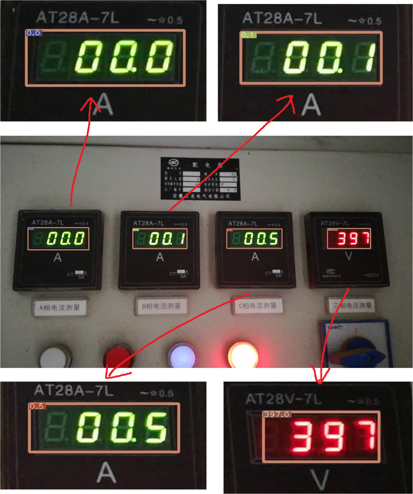

# LED-digital-instrument-detection-demo

### 简介

这只是数字仪表检测的一个demo。

首先使用 [darknet](https://pjreddie.com/darknet/) 训练出自己的模型，模型检测 12 个类别，分别是数字0~9，小数点 point，和字符串定位区域 local  

这些类别你也可以用其他方式实现，比如传统的图像分割+模板匹配，但考虑到仪表种类不同，传统方法可能无法很好的应对。
### 环境
- OpenCV
- Numpy
- pytorch

### 配置

类 detection.py 主要是用于粗检，由于图片分辨率很大，目标很小，粗检是找到仪表可能的位置作为 ROI。

类 detection2.py 用于在粗检得到的 ROI 上作细检，此次检测返回最终示数，并在原图上标注检测结果。
具体的参数设置，在两个类的\_\_init\_\_()初始化函数中有详细解释。

### 结果

检测结果中的数字字符串位置用包围框标注，仪表读数显示在包围框的左上角。  

由于图片分辨率过大，显示的结果相对较小，箭头部分为检测结果图的放大部分。  

所有的最终示数都以浮点数表示。

 图片1检测结果  

 图片2检测结果  

